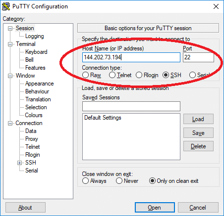
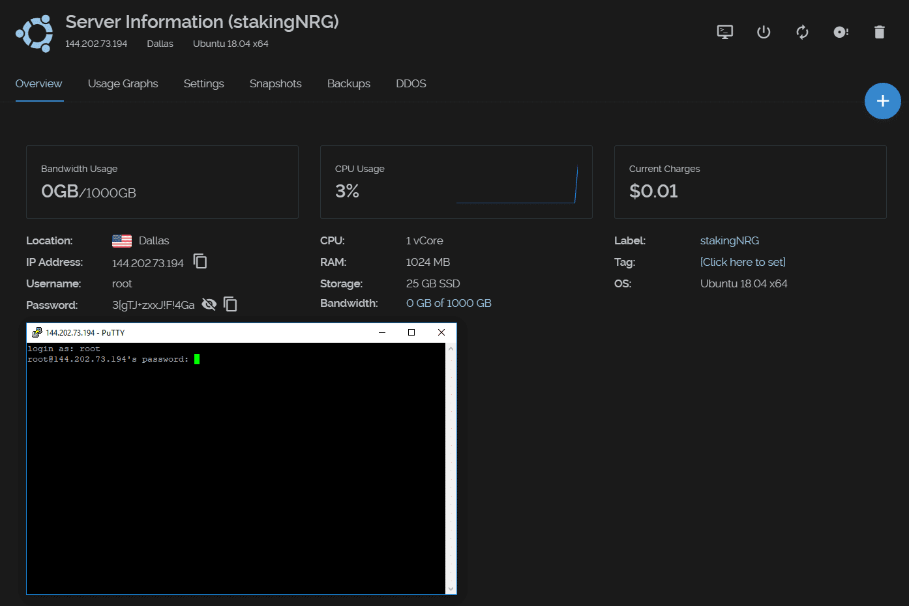
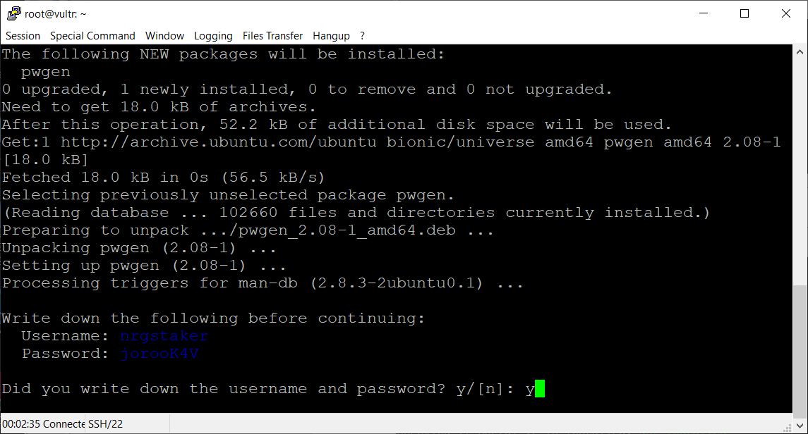
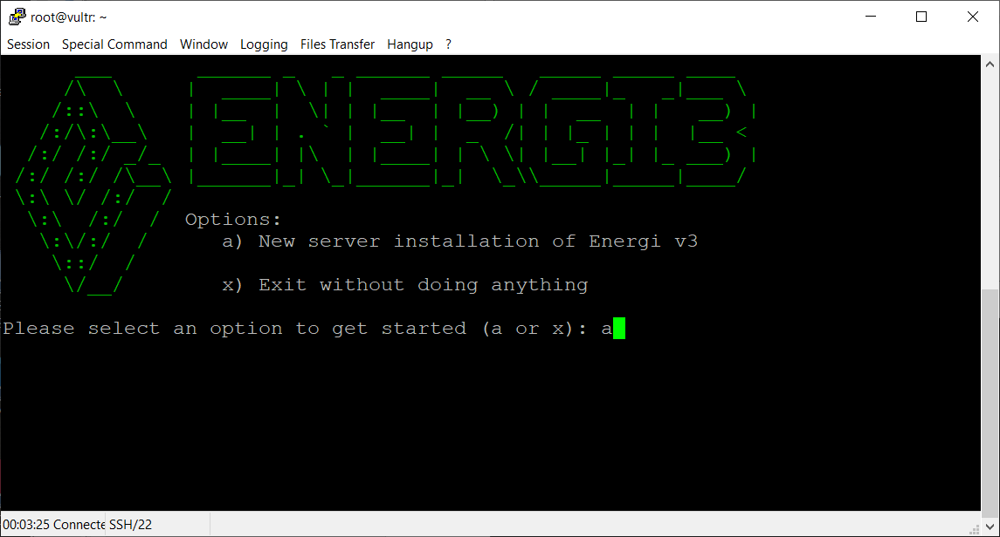
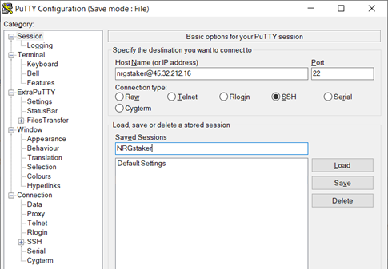
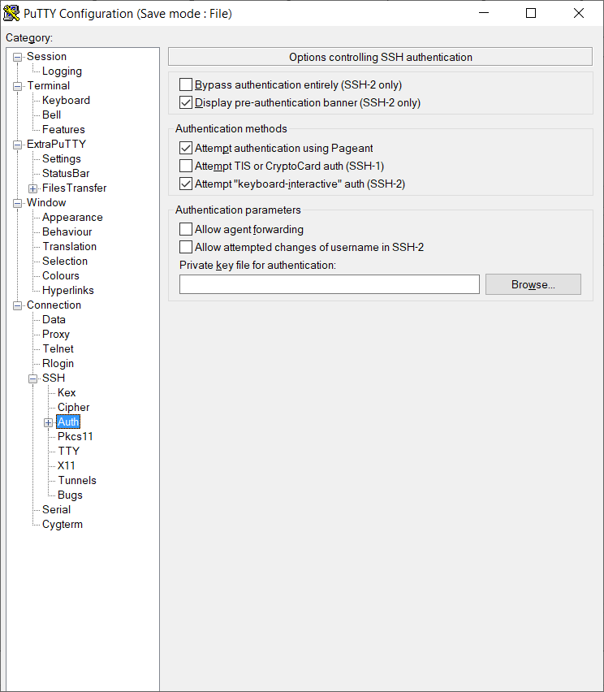

---
## Provision Energi Gen 3 on Linux VPS
---

1 Migrate Gen 2 Wallet to Gen 3 Address File
==========================================

Before continuing with installation of Energi Core Node (aka energi3 software),
you need to first migrate your Gen 2 Wallet to a Gen 3 Address. The diagram
below shows the steps and the tools required to set up a Staking / Masternode.

To migrate Gen 2 NRG to Gen 3 NRG, go to the following steps:

1.  Guide on Creating Gen 3 Address:
    [MyEnergiWallet](https://docs.energi.software/en/how-to/myenergiwallet)

2.  Guide on Migrating Gen 2 Coins: [Energi Core
    Wallet](https://docs.energi.software/en/how-to/migrate-gen2-wallet)

You will need the Gen 3 Account Address File created in MyEnergiWallet during
the installation process.

2 Setup Linux VPS Server
======================

There are many cloud services available to setup a Virtual Private Server (VPS).
Microsoft Azure, Google Cloud Platform (GCP), Amazon Web Services (AWS) and
Alibaba Cloud are few examples of where you can acquire a VPS.

The current specifications for a VPS to run a Energi Gen 3 Masternode are as
follows:

| **Hardware**     | **Minimum**   | **Recommended** |
|------------------|---------------|-----------------|
| CPU (Core)       | 1 x 1 Ghz     | 1 x 1 GHz       |
| RAM (Memory)     | 1 GB          | 2 GB            |
| Disk             | 25 GB SSD     | 40 GB SSD       |
| Swap             | 2 GB          | 0 GB            |
| Bandwidth        | 1 Gb          | 2 Gb            |
| Operating System | Ubuntu x86_64 | Ubuntu x86_64   |

In this guide we are using a VPS from [Vultr](https://vultr.com). 

Choose a server location that is closest to you and cost effective. For
Staking/Masternode, the location is not important.

Select Ubuntu 18.04 x64 as the Server Type.

We recommend a server with 2048 MB (2 GB) of Memory, 55 GB of storage, 1 CPU and
2000GB bandwidth.

Leave the additional features section blank. This guide will not use any startup
scripts. So leave that option alone as well.

*OPTIONAL: You can choose to set up an SSH key to make it easier to securely log
into your server. Click add new and follow the tutorial for creating an SSH key.
This step is optional, but recommended. Using an SSH key to login is not only
easier than using a password, but much more secure.*

Enter a hostname and label (example: stakingNRG) for your server and click
Deploy Now

Wait for your server to install. It should only take a few minutes.

You will receive an email confirming that your server has been created, with
information on how to access it remotely.

3 Login to your VPS
=====================

You can open a console window within Vultr or use any SSH (secure shell)
software to connect to the VPS. If you’re using Windows, we recommend
[PuTTY](https://www.chiark.greenend.org.uk/~sgtatham/putty/latest.html). 
Download putty.exe from the website.

For Secure FTP (SFTP), we recommend
[WinSCP](https://winscp.net/eng/download.php) or
[FileZilla](https://filezilla-project.org/).  In this guide we will use WinSCP
for SFTP.

On Mac and Linux both ssh and sftp already come with the system to login and
securely transfer files respectively.  To login to the VPS from Mac or Linux,
open a Terminal and type command in the following format:

 ssh user\@[server ip address]

Example:

ssh root\@144.202.73.194

On Windows PC, we will assume you are using PuTTY.  Enter your server’s IP
address, make sure SSH and Port 22 are selected and then click “Open”:

You may get a security alert about the server’s rsa2 key fingerprint. Just click
Yes to trust the server and connect via SSH.

Enter the username (root) and password found on your server information page on
my.vultr.com

You are now connected to the VPS using PuTTY terminal.  Once you log on, you
should change your password for user root:

Type passwd

4 Run energi3 Provisioning Tool
=============================

Before you start the installation using the script, make sure you have the
following:

-   **Gen 3 Wallet Address** used to migrate Gen 2 NRG to Gen 3 NRG

-   **Google Authenticator (optional)** if you want 2-Factor Authentication

-   **PuTTYgen (optional)** or similar tool for RSA token based login

The Energi3 Software Provisioning tool (aka the provisioning tool or ESP) will
determine if your installation is:

1.  **New Installation**: If neither Energi Gen 2 or Energi Gen 3 is installed
    on the server, the latest version will be installed on the VPS.

2.  **Upgrade of a previous version of Energi Gen 3**: If a version of Energi
    Gen 3 exists, the script will assume you have already migrated from any
    Energi Gen 2 wallet present on the VPS. It will proceed to check if a newer
    version of Energi Gen 3 exists in the Energi Github repository site and then
    upgrade Energi Gen 3 to the most current version.

To start the installation, login to the VPS using the user root and run the
following command in one line:

bash -ic "\$(wget -4qO- -o-
raw.githubusercontent.com/energicryptocurrency/energi3-provisioning/master/scripts/linux/energi3-linux-installer.sh)"
; source \~/.bashrc

You will see a splash page describing the tool. After 10 seconds it will proceed
to checking that the VPS meets the software requirements.

4.1 Save Username / Password
------------------------

For a new Energi Gen 3 installation, the provisioning tool will create a user
account called nrgstaker to install the software if it does not exist. The
script will create a random password for the user nrgstaker. You will **HAVE
TO** confirm that you wrote down the username and password before proceeding to
the next step.

4.2 New Installation
-----------------

>   Select ‘a’ to install a new installation from the screen below:

4.3 2-Factor Authentication (optional)
--------------------------------------

2-Factor Authentication (2FA) is *optional* but suggested. This is *not
required* if you plan to use RSA token-based login described in the next
section. 2FA requires you to install Google Authenticator (GA) on your mobile
phone. GA will generate a one-time password (OTP) every 60 seconds. It must be
used in addition to your regular password to login to your VPS. If someone gets
your regular password, they still will not be able to login to the VPS without
the OTP which changes every 60 seconds. Select y if you want to setup 2FA or n
to skip and go to setup RSA.

If you select y to setup 2FA, a QR code will appear. Scan the QR code using
Google Authenticator. Type the 6-digit code to continue. If you change your
mind, you can simply hit enter and the tool will move to the next step.

The provisioning tool will provide 10 codes that you can use in case of
emergency. If you plan to use them, please make sure you store them in a safe
place, so no one has access to them.

4.4 RSA Token-Based Login
-------------------------

This is an optional step to setup RSA token-based private / public key
authentication method. You share the public key and store it on the computer.
The private key stays with you and needs to be secured. The next few steps shows
how to setup RSA key to login to the VPS. If you use RSA key, you will not need
to remember you regular password or use the OTP to login.  
  
Select y if you want to setup RSA token-based authentication. If you select n,
it will take you to the next section.

You will need a tool like **PuTTYgen** Key Generator to create a Public key and
a Private key for the login. You will select Generate and then move your mouse
around, so it creates a random key. In the comment section add nrgstaker and
save the public and private keys on your computer. From the screen Select All
the public key and Copy it.

Now go back to the PuTTY terminal session and paste the public key. Once you hit
the Enter key, the RSA key will be added to the user nrgstaker. Later in the
document, we will show how to login to the VPS using RSA token.

4.5 Download and Install energi3
--------------------------------

The provisioning tool will download the latest version of Energi3 from Github
and a few scripts.

4.6 Copy Gen 3 address file to VPS
----------------------------------

Next the provisioning tool will help you copy the Gen 3 address file over to the
VPS. Select the URL (<https://send.firefox.com/>) to go to the website.

Pick “Select files to upload” on the Firefox website. Please select only the Gen
3 address file that you want to use to stake or run masternode with on the VPS.

After you select the Gen 3 address file, pressing Open. It will need to Upload
the file to Firefox. We recommend you use the default setting, so the file
expires after 1 download or 1 day. This way no one else can download the file
after you have downloaded it on the VPS.

Once the upload is complete, pick “Copy link”.

Now go back to the PuTTY terminal connected to the VPS and paste the link then
hit ENTER.

The provisioning tool will copy the Gen 3 address file to the appropriate
directory so Energi Core Node (energi3) can access it. Hit ENTER to go to the
next step.

4.7 Setup Auto Restart
----------------------

The following step will ask for the passphrase you used to encrypt the Gen 3
address file. This will be stored in a secure location on the server. After any
computer reboot, energi3 will be automatically started. Staking will also be
enabled using the passphrase so you do not need to manually enter.

**CAUTION: Since the passphrase is saved on the VPS, if someone can login to it,
they will have access to the wallet. We have taken prudent measures to secure
the passphrase. However, there is always a chance if someone can login to your
VPS, they can access the passphrase. For this reason we recommend either use 2FA
or a token-based login.**

Once the passphrase is saved, the provisioning tool will exit with the following
message.

Congratulations! You have installed energi3 on the VPS.

5 How to Set up PuTTY to Login with RSA Key
=========================================

Open a new PuTTY Configuration session. In the Hostname add:

nrgstaker\@IP_of_VPS

In our example, the IP_of_VPS is 45.32.212.16. You will have a different IP
address provided to you by Vultr.

Under Category, select Auth:

Now Browse to select the private key file you created in the previous section.
In our example, the file is called nrgstaker-priv.ppk. It is saved in
C:\\Users\\pcuser\\putty directory. You can select any directory you choose.
Just remember you cannot delete the RSA private key. If you do, you will have to
use your regular password to login to the VPS.

When you use RSA private key to login to the VPS, the username nrgstaker is not
prompted for a password. You will see the following screen:

